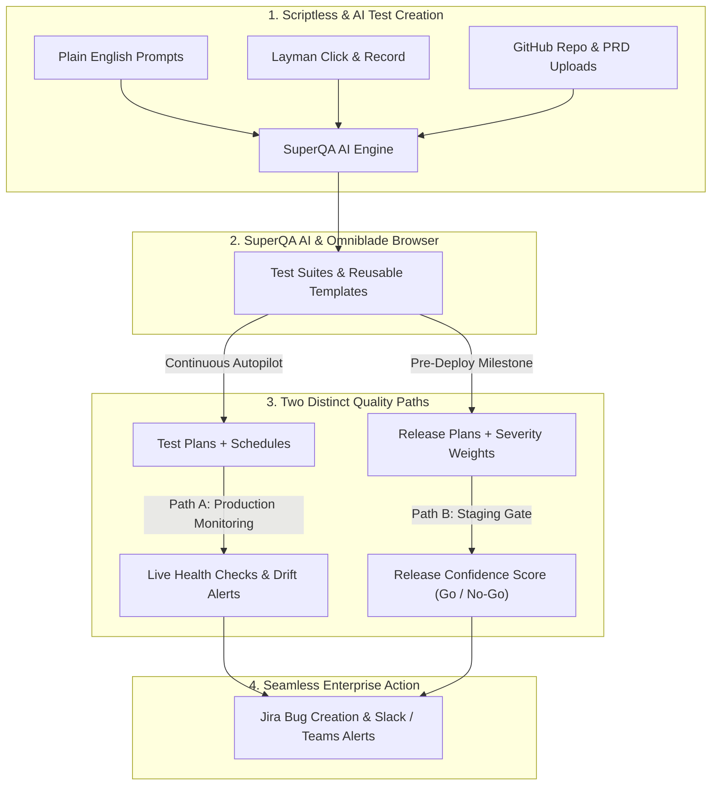

# Introduction to SuperQA

## 🚀 The Outcome: What You Get
Imagine achieving **100% end-to-end test coverage** across your user flows with **zero script maintenance**, **10x faster test creation**, and continuous autopilot production monitoring—all without writing or debugging a single line of automation code.

SuperQA empowers your entire team (developers, QA analysts, and product managers) to create bulletproof tests in **plain English**, gain definitive go/no-go release confidence before deploying, and gain peace of mind knowing your scheduled test plans are proactively checking your live production environments at your defined intervals.

---

## 🛑 The Problem: Why Traditional QA Fails
Traditional test automation is broken. Teams are forced to:
* **Wrestle with Fragile Scripts:** Spend countless engineering hours writing and debugging complex Playwright, Cypress, or Selenium code.
* **Drown in Maintenance Churn:** Watch automated suites fail constantly just because a developer changed a CSS class, DOM hierarchy, or button ID.
* **Suffer from QA Silos:** Rely entirely on specialized automation engineers, creating bottlenecks that delay staging sign-offs and production releases.

---

## 💡 The SuperQA Solution: Architectural Flow

SuperQA shatters this paradigm by combining proprietary visual AI with our **Omniblade Embedded Chrome Browser**. Instead of reading through endless feature lists, explore how SuperQA solves the traditional QA bottleneck by dividing quality into two powerful, automated execution paths:

---

## Core Unique Selling Propositions (USPs)

SuperQA is engineered around four core pillars designed to maximize test coverage while eliminating test maintenance:

### 🧠 1. Scriptless AI & Layman Recording
* **No CSS Selectors or XPaths:** Write declarative test steps in plain English (e.g., *"Click the large blue Checkout button"*). The AI natively interprets your application's DOM and executes interactions reliably.
* **Layman Click & Record:** Any non-technical user (Product Manager, Designer, Stakeholder) can navigate the application inside our **Omniblade Embedded Chrome Browser**. SuperQA silently records their clicks and inputs, converting them into formal, automated plain English steps.
* **DRY Architecture:** Build modular **Reusable Templates** for common flows (like authentication or cart management) and embed them across dozens of test cases. Update the template once, and all linked cases inherit the changes instantly.

### ⏱️ 2. Continuous Production Monitoring
* **Test Plans + Schedules:** Group your suites into targeted strategies (Smoke, Sanity, Regression) and attach them to automated schedules.
* **Automated Scheduled Checks:** Your scheduled Test Plans execute automatically at your configured intervals (hourly, daily, or weekly) against live production environments, alerting your engineering team whenever a user flow breaks.

### 📈 3. Staging Gates & Release Confidence
* **Milestone-Driven Gating:** Map your upcoming major, minor, or hotfix release features into dedicated **Release Plans** executed on-demand in staging environments right before deployment.
* **Weighted Confidence Score:** Instead of a basic pass/fail ratio, SuperQA calculates a predictive **Release Confidence Score** based on customizable **Severity Weights** (Blocker down to Trivial). A failed Blocker halts the release, while trivial cosmetic bugs won't block your deploy.

### 🔄 4. Self-Healing & Drift Detection
* **Immune to UI Churn:** When developers change button IDs or adjust CSS classes, SuperQA's visual AI automatically locates the correct elements and continues execution, drastically reducing test flakiness and maintenance overhead.
* **Quality Drift Detection:** Our Continuous Quality Monitoring (CQM) module longitudinally tracks your stability, alerting engineering leads to gradual technical debt accumulation or sudden quality drops across sprints.

---

## Next Steps

Ready to experience scriptless AI automation? Dive right into the foundational guides:

* **[Dashboard Overview](./dashboard.md)** — Learn how to read your workspace metrics and live activity feed.
* **[AI Test Case Generation](./build/test-case-gen.md)** — Generate your first bulletproof test suite from a URL, PRD, or connected GitHub repo.
* **[Test Suites & AI Execution](./build/test-suites/overview.md)** — Master plain English automation and the Omniblade embedded browser.
