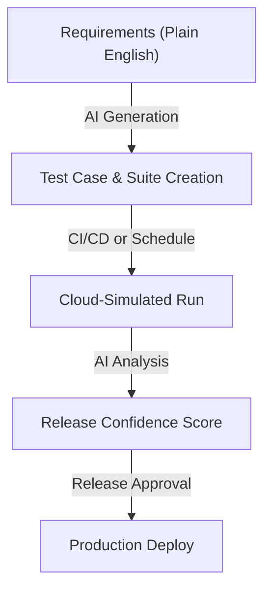

# Introduction to SuperQA

Welcome to the **SuperQA Developer Hub**—the complete AI-driven QA orchestration platform designed to generate, execute, and analyze software tests without writing a single line of test code. 

SuperQA bridges the gap between development and quality assurance by allowing you to define, plan, and run tests in **plain English**. Powered by advanced generative AI, SuperQA translates natural language requirements into robust, self-healing test executions, giving you continuous feedback and release confidence.

---

## What is SuperQA?

SuperQA is an end-to-end testing platform that automates the entire QA lifecycle. Instead of writing, maintaining, and debugging fragile Playwright, Cypress, or Selenium scripts, you manage quality using declarative, user-centric flows.

> [!NOTE]
> **No Scripting Required:** Write test plans in simple, plain English. SuperQA's AI engine interprets your instructions, identifies the target UI elements dynamically, and executes the actions on our cloud-simulated environments.

---

## How It Works

SuperQA organizes your quality lifecycle into four unified stages:

### 1. Generate (AI Test Case Gen)
*   **Automatic Generation:** Input your product URL or user story, and SuperQA will automatically discover paths and generate comprehensive test plans in plain English.
*   **Declarative Steps:** Edit or add new test steps using natural language. No CSS selectors or XPath paths are needed.

### 2. Build & Plan
*   **Test Suites & Plans:** Group your test cases into modular Test Suites and organize them into **Test Plans**. Connect your Test Plans to automated **Schedules** to achieve continuous product monitoring and automated regression alerts.
*   **Release Plans:** Define release gates with **Release Plans** that aggregate test results across your features to calculate a predictive **Release Confidence Score** before deployment.
*   **Test Data Management:** Inject variables and datasets dynamically into your test executions to run boundary value analyses and multi-user scenarios.

### 3. Run & Automate
*   **Cloud Simulator Playback:** Tests are executed on secure, sandboxed cloud environments. SuperQA records full video playback and takes snapshots of every step.
*   **CI/CD Orchestration:** Trigger test executions automatically via our **Jenkins Plugin** or **GitHub Action** during your PR checks or release pipelines.

### 4. Analyze & Connect
*   **Automatic Defect Creation:** Link your workspace with **Jira** to automatically file detailed bug reports (complete with video recordings and steps) when tests fail.
*   **Real-time Alerts:** Route instant status reports to **Slack** channels or team **Emails**.

---

## Core Key Features

### 🧠 Plain-English Test Writing
Describe what you want to test in standard language (e.g., *"Sign in with demo credentials, click the checkout button, and verify that the payment success message appears"*). The AI understands the layout of your page and performs the steps reliably.

### ⏱️ Schedules & Continuous Monitoring
Keep a pulse on your product's health around the clock. By scheduling your **Test Plans** to execute automatically at set intervals, SuperQA performs continuous product monitoring and immediately notifies your team if any user flows break.

### 📈 Release Confidence Score
Get a machine-learning-backed quality assessment before every production deploy. Linked directly to your **Release Plans**, the **Release Confidence Score** evaluates current pass rates, regression risks, historical stability, and test coverage to determine whether your build is safe to deploy.

### 🔄 Self-Healing Executions
Tired of tests breaking because a developer changed a CSS class or button ID? SuperQA uses visual AI models to locate elements, making your test suites highly resilient to minor UI changes.

### 🔌 Seamless Tool Integrations
Connect with the developer tools you use daily:
*   **CI/CD**: Jenkins, GitHub Actions
*   **Notifications**: Slack, Email Alerts
*   **Issue Tracking**: Jira ticket synchronization

---

## Next Steps

Ready to get started? Explore the following guides:
*   [Dashboard Overview](./dashboard.md) — Learn how to navigate your SuperQA control panel.
*   [Test Case Gen](./build/test-case-gen.md) — Write your first scriptless, plain-English test case.
*   [Setting Up Integrations](./configure/integrations/jenkins/overview) — Link Jenkins, GitHub, Jira, and Slack to your workflow.
